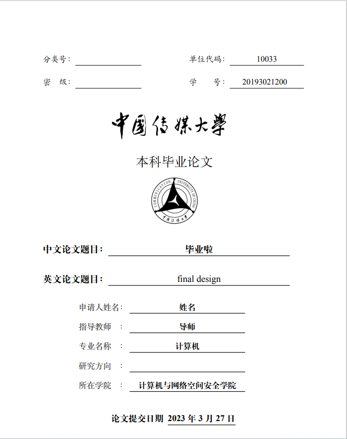

# 中国传媒大学 学士学位 毕业论文模板

## 介绍

本项目可以仅将内容填充进指定区域就可以生成一份精美的CUC毕业设计论文。

但建议使用者掌握一定的Latex语法基础。

建议使用者来自**计网学院**，作者不保证其他学院的模板相同。

## 内容组成
 本科毕业论文文件夹cuc_thesis_latex_template下面共包含了1个子目录imgs、7个.tex文件、1个.cls文件、1个.bib文件和1个.md文件、1个PDF文件。

1. imgs子目录用于存放论文中引入的图形文件，例如.jpg或者.png文件。

2. main.tex是论文的骨架文件，鼓励在此文件为基础上，将自己的论文内容，包括中英文标题、中英文摘要、论文各个章节所在的文件名、参考文献数据库信息填充按照指定位置填入。
         
3. section_01、section_02、section_03、section_04和section_05等5个.tex文件分别代表论文第一章至第五章，同样，可以用自己的论文内容填充进去。
         
4. appendix_A.tex是附录文件，请根据需要用自己的内容填充。
 
5. cucuthesis.cls文件是LaTeX的类文件，也是格式文件，它决定了LaTeX源文件.tex的排版布局。如格式存在问题可以自行修改 

6. references.bib是文献数据库，建议使用BibTex存储，可以看到bib文件中的示例（大名鼎鼎的transformer你得引一下对吧）。


## 模板演示
<div align=center>

</div>

详情请看本目录下**thesis_latex_template.pdf**文件

## 实现细节

编译器建议使用: LualaTex，作者不保证在其他编译器上可以正确的渲染

建议使用平台： [overleaf](https://www.overleaf.com/) 避免本地安装环境


## Why Latex？

- 使用LaTeX排版学术材料是极受欢迎的，优秀的国际会议和权威的学术杂志鲜见不接受LaTeX投稿的，相反，它们会主动提供符合自家排版要求的LaTeX模板，学者不需要再根据其要求大费周折。
- 对于计算机专业学生，“看代码→写代码→编译→看结果”的过程非常熟悉，Word学习成本相较于Latex只高不低，如果您对于Word排版并不熟悉，不如尝试使用Latex，掌握一项新的技能。

## 使用教程

保证您的电脑中安装过git工具

```git clone ```本项目即可。


## 注意

**本项目由作者仔细对照中国传媒大学毕业论文模板和格式说明中的PDF文件进行编写，格式要求在目前看上去完全符合，但作者并不能保证传媒大学官方在2023年接收此格式的论文，但作者会使用该模板提交论文。**


**如果你在毕业论文中使用了此模板，希望你能在附上该项目github链接并致谢该项目的所有贡献者。**

**如对本格式提出问题，欢迎PR，或者私下和我交流。**


**本项目由@[LyuLumos](https://github.com/LyuLumos)模板改进制成，感谢师哥提供帮助。**

作者更加希望中国传媒大学教务部门**锐意进取、大胆创新、敢为人先**地提供官方的毕设LaTeX模板。


